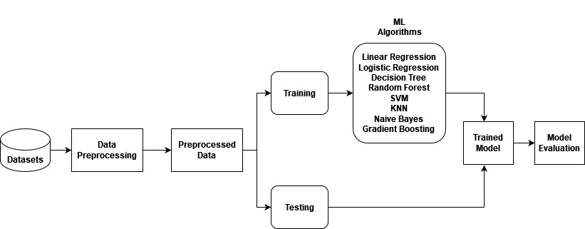

# Telecom Customer Churn Prediction

This project focuses on predicting telecom customer churn using various machine learning algorithms. It includes a complete exploratory data analysis (EDA) and an end-to-end training pipeline. Both the code-based implementation and a Jupyter Notebook version are provided for flexibility and reproducibility. The goal is to analyze and compare the performance of different models in terms of accuracy, precision, recall, and F1-score.


---

## 📊 Problem Statement

Telecom companies face significant revenue loss due to customer churn. By leveraging machine learning techniques, this project aims to predict whether a customer is likely to churn based on their usage patterns and demographics.

---

## 📁 Dataset

**Source**: [Kaggle - Telecom Customer Churn](https://www.kaggle.com/datasets/blastchar/telco-customer-churn)  
- **Description**: The dataset includes features such as customer account information, service usage patterns, and contract details. The target variable is `Churn` which indicates whether a customer has left the company or not.

---

## 🛠️ Project Structure

```
telecom-churn-prediction/
│
├── config/
│    └── config.yaml
├── data/
│    └── Telecom Customers Churn.csv
├── modeling/
│     ├── init.py
│     ├── models.py
│     ├── model_training.py
│     └── model_evaluation.py
├── notebooks/
│     └── telecom-churn-prediction.ipynb
├── preprocessing/
│     ├── init.py
│     ├── pca_transformer.py
│     └── preprocessing.py
├── utils/
│     ├── init.py
│     └── utils.py
├── visualization/
│     ├── init.py
│     ├── visualization.py
│     └── architecture.png # Project architecture diagram
├── train_pipeline.py
├── main.py
├── utils.py
├── requirements.txt
└── README.md
```
---

## Data Flow in Training 


---

## 🔍 Model Performance

| Model                    | Accuracy | Precision | F1-score | Recall |
|-------------------------|----------|-----------|----------|--------|
| Logistic Regression     | 0.814    | 0.629     | 0.610    | 0.593  |
| Ridge Classifier        | 0.804    | 0.616     | 0.570    | 0.531  |
| Decision Tree (Entropy) | 0.743    | 0.478     | 0.498    | 0.520  |
| Decision Tree (GINI)    | 0.732    | 0.455     | 0.465    | 0.476  |
| Random Forest (Entropy) | 0.803    | 0.618     | 0.563    | 0.517  |
| Random Forest (GINI)    | 0.797    | 0.606     | 0.541    | 0.488  |
| Support Vector Classifier| 0.785   | 0.603     | 0.446    | 0.354  |
| K-Nearest Neighbors     | 0.777    | 0.545     | 0.550    | 0.555  |
| Naive Bayes             | 0.736    | 0.476     | 0.584    | 0.755  |

---

## ✅ Key Takeaways

- **Best Performing Model** (Overall): Logistic Regression, with the highest F1-score and balanced performance.
- **Highest Recall**: Naive Bayes, capturing the most churn cases but at the cost of precision.
- The trade-offs between precision and recall are crucial depending on the business requirement (e.g., catching more churners vs. fewer false positives).

---

## 🚀 How to Run

### 1. Clone the repository
   ```
   git clone https://github.com/your_username/telecom-churn-prediction.git
   
   cd telecom-churn-prediction
   ```
### 2. Install dependencies
   ```
   pip install -r requirements.txt
   ```
### 3. Run the main pipeline
   ```
   python main.py
   ```

## 📌 Requirements
All required libraries are listed in requirements.txt. Key libraries include:
```
pandas
numpy
scikit-learn
matplotlib
seaborn
pyyaml
```

Install them with:
```
pip install -r requirements.txt
```

## 📄 License

This project is open-source and available under the **MIT License**.

---

## 👥 Contributors

- **Parthasaradhi G**  
  GitHub: [@parthu1029](https://github.com/parthu1029)  
  Role: Project Author & Developer

- **Siddardha S**  
  GitHub: [@tmfsiddu](https://github.com/tmfsiddu)  
  Role: Contributor / Collaborator

- **Sujith B**  
  GitHub: [@sujith-2424](https://github.com/sujith-2424)  
  Role: Contributor / Collaborator
---


Feel free to open an issue or reach out for questions, collaborations, or feedback.
